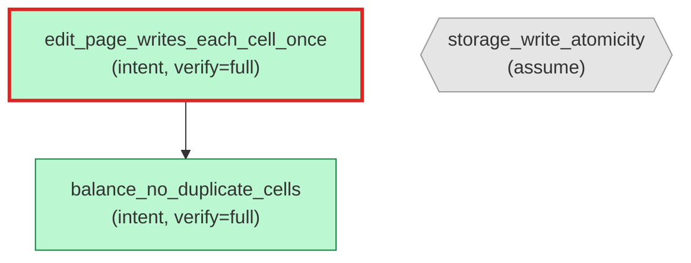

## Aristo verified annotations

This crate carries **3 Aristo annotations** (2 intent · 1 assume).

| Verify level | Count |
|---|---|
| `false` (documentation only) | 0 |
| `"neural"` | 0 |
| `"test"` | 0 |
| `"full"` | 2 |

**0 annotations are server-bound** (`aristos:` namespace) and verified by the
Aristo proof system. See the [annotation graph](./_graph.svg) for the full
property structure.

---

## Annotation graph

