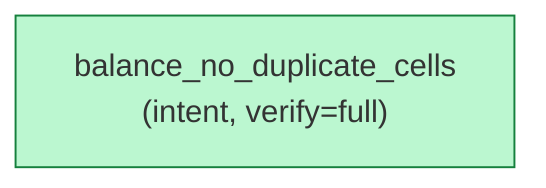

# `aristo graph` — composed filters AND together

Source: `../aretta-sdk/docs/mockups/10-doc-and-graph/cli-sessions.md` § "I2 → Combined filters".

Multiple `--filter` flags AND together (per the J2 unified grammar). All annotations must match ALL filters to be rendered.

````console
$ aristo graph --filter file=core/storage/btree.rs --filter status=verified
? 0

ok: 1 nodes, 0 edges rendered. (Mermaid to stdout)

````
