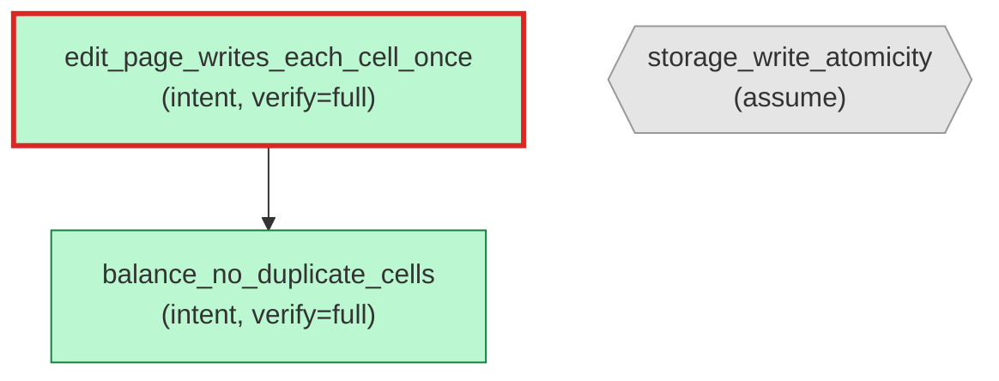

# `aristo graph` — default Mermaid output to stdout

Source: `../aretta-sdk/docs/mockups/10-doc-and-graph/cli-sessions.md` § "I2 → Default — Mermaid to stdout".

Default format is Mermaid `flowchart TD` (top-down). No external dependency. Pastes directly into GitHub READMEs (renders inline) or any markdown viewer that supports Mermaid. Visual encoding: color = verify level (gray=`false`, yellow=`neural`, blue=`test`, green=`full`); shape = kind (rectangle=intent, hexagon=assume); border = red for critical status (stale/orphan/forged), default otherwise.

This scenario uses a minimal fixture of 3 annotations (2 intents + 1 assume + 1 parent edge + 1 stale-status critical border) so the output can be matched byte-for-byte.

````console
$ aristo graph
? 0

ok: 3 nodes, 1 edges rendered. (Mermaid to stdout)

````
