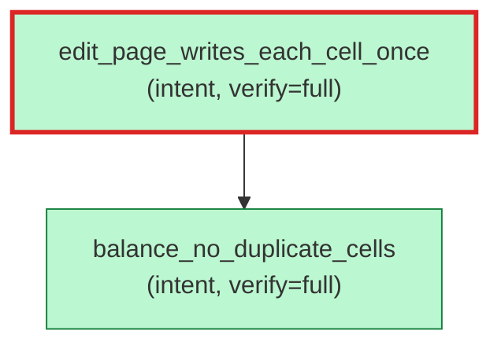

# `aristo graph --exclude-assumes` — focus on the intent graph

Source: `../aretta-sdk/docs/mockups/10-doc-and-graph/cli-sessions.md` § "I2 → `--exclude-assumes` — focus on intent graph".

Hides `assume` nodes from the rendered graph. Default is to include them — assumes form the "ground" of the property graph and dropping them by default would hide load-bearing background facts. Useful when the question is "what's the verified-property structure" and the OS / library assumptions are noise.

````console
$ aristo graph --exclude-assumes
? 0

ok: 2 nodes, 1 edges rendered. (Mermaid to stdout)

````
