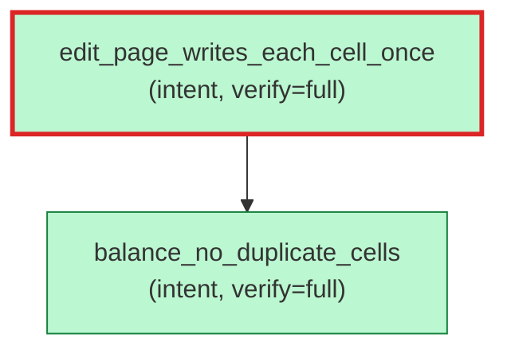

# `aristo graph --filter file=<path>` — per-file scope

Source: `../aretta-sdk/docs/mockups/10-doc-and-graph/cli-sessions.md` § "I2 → Filtering — per-file".

`--filter file=<path>` restricts rendered nodes to annotations in the given file. The slice-29-MVP shape is exclusion-only; auto-inclusion of immediate external parents for context is a follow-up (the design doc's "+ immediate parents for context" pattern lands when the `--depth` flag in commit 7 grows beyond strict-match semantics).

````console
$ aristo graph --filter file=core/storage/btree.rs
? 0

ok: 2 nodes, 1 edges rendered. (Mermaid to stdout)

````
