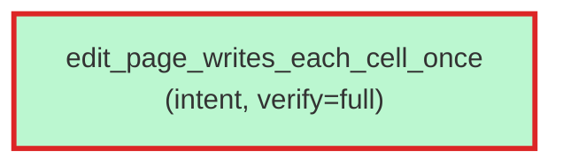

# `aristo graph --filter status=<state>` — status-filtered visualization

Source: `../aretta-sdk/docs/mockups/11-gap-closures/cli-sessions.md` § "J3 — `aristo graph --filter status=...`".

J3 added `status=<state>` to the unified filter grammar's surfacing on `aristo graph`. Useful for review-meeting questions like "show me what's still unverified" or "show me only the stale ones".

````console
$ aristo graph --filter status=stale
? 0

ok: 1 nodes, 0 edges rendered. (Mermaid to stdout)

````
