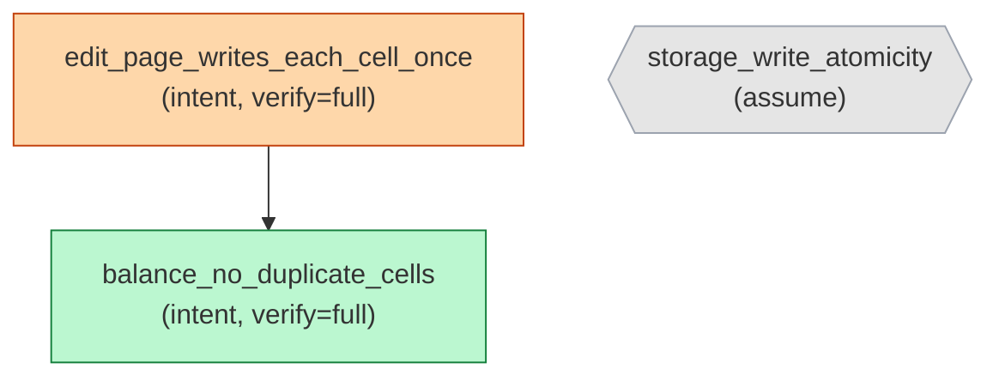

# `aristo graph --include-status` — color-by-status

Source: `../aretta-sdk/docs/mockups/10-doc-and-graph/cli-sessions.md` § "I2 → `--include-status` — status-colored".

`--include-status` swaps the color axis from verify level to current B5b status. Verify level moves to an in-node label. Use when the dominant question is "what's still unverified" (review meetings, audit prep). Default mode (verify-level coloring) is for documentation use (READMEs, rustdoc).

The status palette differentiates severity directly (red border on sForged / sCounterexample / sInconclusive), so the verify-mode "critical" overlay isn't stacked on top.

````console
$ aristo graph --include-status
? 0

ok: 3 nodes, 1 edges rendered. (Mermaid to stdout)

````
